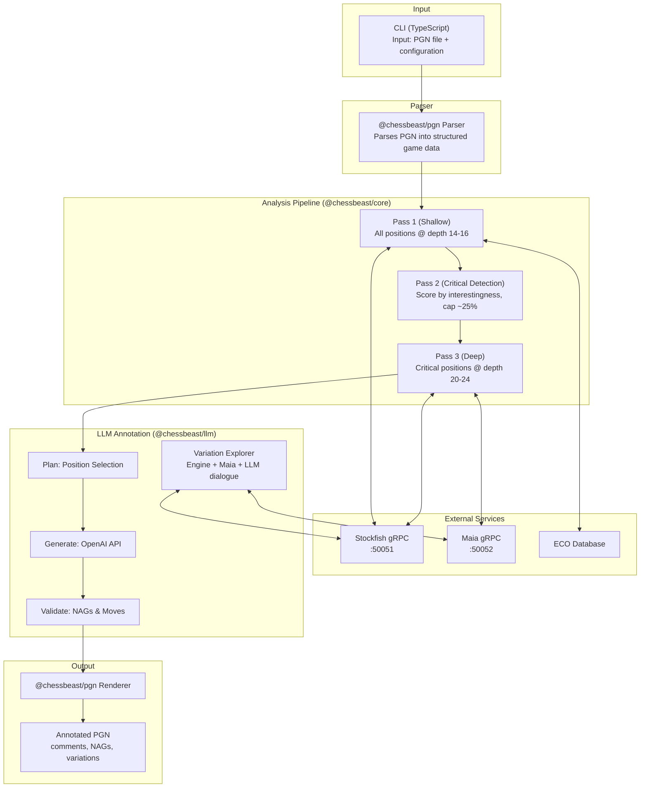
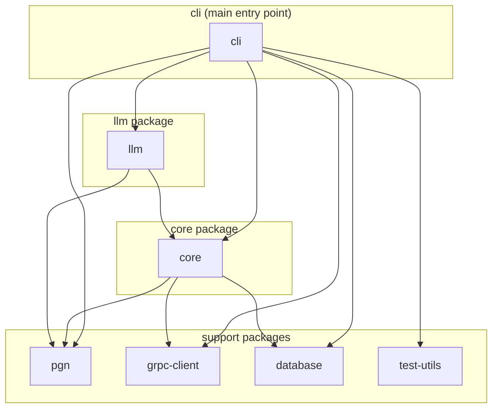
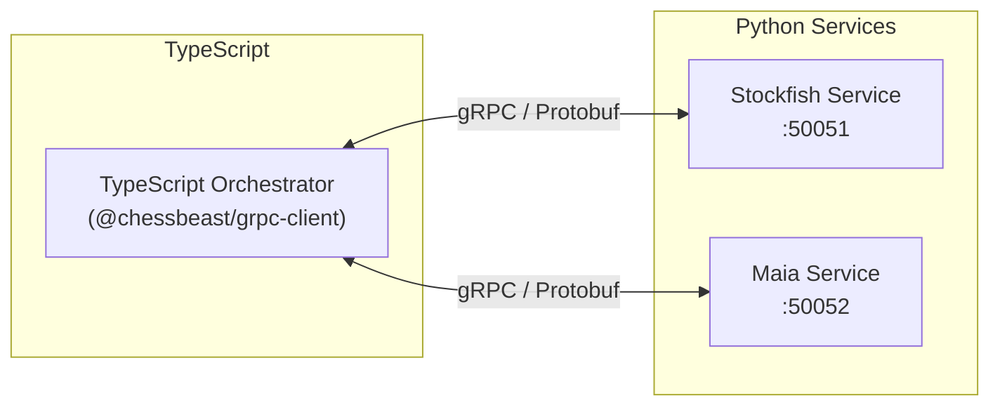

# Architecture

ChessBeast is a hybrid TypeScript + Python monorepo that combines multiple analysis engines to produce human-friendly chess game annotations.

## System Overview



## Package Structure

### TypeScript Packages (`packages/`)

| Package | Purpose | Key Exports |
|---------|---------|-------------|
| **cli** | CLI entry point, orchestration, configuration | `analyze` command, config loader |
| **core** | Analysis pipeline, move classification, critical moments | `AnalysisPipeline`, `GameAnalysis` |
| **pgn** | PGN parsing and rendering | `PgnParser`, `PgnRenderer`, `ParsedGame` |
| **grpc-client** | gRPC clients for Python services | `StockfishClient`, `MaiaClient` |
| **database** | SQLite database clients | `EcoClient`, `LichessEliteClient` |
| **llm** | OpenAI integration, annotation generation, variation exploration | `CommentGenerator`, `AnnotationPlanner`, `VariationExplorer`, model pricing |
| **test-utils** | Shared test utilities and mocks | Test fixtures, mock services |

### Python Services (`services/`)

| Service | Port | Purpose |
|---------|------|---------|
| **stockfish** | 50051 | UCI engine wrapper for position evaluation |
| **maia** | 50052 | Maia2 model serving for human-likeness prediction |

### Data (`data/`)

| Database | Purpose |
|----------|---------|
| `eco.db` | ECO opening classification lookup |
| `lichess_elite.db` | Reference games from Lichess Elite (2200+) |

## Package Dependencies



## Key Data Types

### GameAnalysis

The central output type containing complete game analysis:

```typescript
interface GameAnalysis {
  metadata: {
    white: string;
    black: string;
    result: string;
    event?: string;
    eco?: string;
    openingName?: string;
    whiteElo?: number;
    blackElo?: number;
  };
  moves: MoveAnalysis[];
  criticalMoments: CriticalMoment[];
  stats: GameStats;
  summary?: string;
}
```

### MoveAnalysis

Analysis for a single move:

```typescript
interface MoveAnalysis {
  plyIndex: number;
  moveNumber: number;
  isWhiteMove: boolean;
  san: string;                    // Standard Algebraic Notation
  fenBefore: string;
  fenAfter: string;
  evalBefore: EngineEvaluation;
  evalAfter: EngineEvaluation;
  bestMove: string;               // Engine's best move
  cpLoss: number;                 // Centipawn loss
  classification: MoveClassification;
  humanProbability?: number;      // From Maia (0-1)
  alternatives?: AlternativeMove[];
  isCriticalMoment: boolean;
  comment?: string;               // LLM annotation
}
```

### MoveClassification

```typescript
type MoveClassification =
  | 'book'       // Opening theory
  | 'excellent'  // Best or near-best
  | 'good'       // Solid move
  | 'inaccuracy' // Minor error
  | 'mistake'    // Moderate error
  | 'blunder'    // Major error
  | 'brilliant'  // Unexpected excellence
  | 'forced'     // Only reasonable option
```

## Two-Pass Analysis Strategy

ChessBeast uses a two-pass analysis approach to balance depth with efficiency:

### Pass 1: Shallow Analysis
- **Depth**: 12-16 (profile dependent)
- **Scope**: All positions
- **Purpose**: Quick evaluation, opening detection, initial classification

### Pass 2: Deep Analysis
- **Depth**: 20-28 (profile dependent)
- **Scope**: Critical moments only (~25% of moves)
- **MultiPV**: 3-5 lines
- **Purpose**: Alternative variations, detailed evaluation

## Critical Moment Detection

Critical moments are identified based on:

| Type | Description |
|------|-------------|
| `eval_swing` | Large evaluation change (>100cp) |
| `result_change` | Position changed from winning to losing/drawn |
| `missed_win` | Player missed a winning move |
| `missed_draw` | Player missed a drawing move |
| `phase_transition` | Opening→middlegame or middlegame→endgame |
| `tactical_moment` | Forcing sequence or sacrifice opportunity |
| `blunder_recovery` | Recovery from a previous mistake |

Moments are scored by "interestingness" (0-100) and capped at `maxCriticalRatio` of total moves.

## Variation Exploration

The `VariationExplorer` (`packages/llm/src/explorer/`) implements an iterative dialogue between engine, Maia, and LLM:

### Exploration Flow

1. **Engine Analysis**: Get best line with MultiPV=3
2. **Maia Prediction**: Get human-likely move at target rating
3. **LLM Decision**: Evaluate candidates, decide exploration strategy
4. **Depth-First**: Follow main line deep (up to 40 moves)
5. **Human Mistakes**: Show Maia-predicted alternatives with engine refutation
6. **Tension Resolution**: Continue exploration until position stabilizes
7. **Self-Regulation**: LLM can request more exploration within budget

### Key Features

- **`exploreMistakeLine`**: When Maia predicts a human-likely move different from best, the explorer makes that move and shows the engine's refutation (not just a stub)
- **Tension Resolution**: Variations stop when captures and checks have resolved, not at arbitrary depth limits
- **Position NAGs**: Position assessment NAGs ($10-$19) appear only at the END of explored variations, showing the consequence of the line
- **Error Severity**: Inaccuracies in already-losing positions get minimal analysis; opening inaccuracies get full analysis due to butterfly effect

### Line Types

| Purpose | Description |
|---------|-------------|
| `best` | Engine's recommended continuation |
| `human_alternative` | Maia-predicted move with engine refutation |
| `refutation` | Line showing why an alternative fails |
| `trap` | Deceptive line with a hidden refutation |
| `thematic` | Illustrates an important strategic idea |

### Budget Management

| Parameter | Default | Description |
|-----------|---------|-------------|
| `softCallCap` | 15 | Target LLM calls per position |
| `hardCallCap` | 22 | Maximum LLM calls (1.5x soft cap) |
| `maxDepth` | 40 | Maximum variation depth in moves |

### PlannedVariation Interface

Ensures LLM commentary references actual PGN output:

```typescript
interface PlannedVariation {
  moves: string[];        // SAN moves in the variation
  purpose: LinePurpose;   // best, human_alternative, etc.
  source: LineSource;     // engine, maia, llm
  finalEval?: EngineEvaluation; // For position NAG at end of line
}
```

Prompts include these variations so LLM can reference specific lines.

## Move Classification Thresholds

Thresholds are rating-dependent to account for different skill levels:

### 1200 ELO
| Classification | Centipawn Loss |
|----------------|----------------|
| Inaccuracy | 50-149 |
| Mistake | 150-299 |
| Blunder | ≥300 |

### 2000 ELO
| Classification | Centipawn Loss |
|----------------|----------------|
| Inaccuracy | 30-89 |
| Mistake | 90-179 |
| Blunder | ≥180 |

## Service Communication

Services communicate via gRPC with Protocol Buffers:



Proto definitions are in `services/protos/`:
- `common.proto` - Shared types (Position, Move)
- `stockfish.proto` - Engine evaluation service
- `maia.proto` - Human-likeness prediction service

## Error Handling

ChessBeast implements graceful degradation:

1. **Maia unavailable**: Continue without human-likeness scores
2. **LLM unavailable**: Fall back to template-based comments
3. **Database unavailable**: Skip opening/reference game lookup
4. **Engine timeout**: Use partial results or skip position

Use `--skip-maia` and `--skip-llm` flags for offline analysis.

## LLM Model Selection

ChessBeast supports multiple OpenAI GPT-5 model tiers:

| Model | Input | Output | Use Case |
|-------|-------|--------|----------|
| `gpt-5-codex` | $1.25/1M | $10.00/1M | Deep reasoning, complex analysis |
| `gpt-5-mini` | $0.25/1M | $2.00/1M | Balanced quality/cost (default) |
| `gpt-5-nano` | $0.05/1M | $0.40/1M | Budget-friendly, fast |

Configure via:
- CLI: `--model gpt-5-nano`
- Environment: `CHESSBEAST_LLM_MODEL=gpt-5-nano`
- Config file: `llm.model: "gpt-5-nano"`

Pricing is tracked in `packages/llm/src/cost/pricing.ts`.
