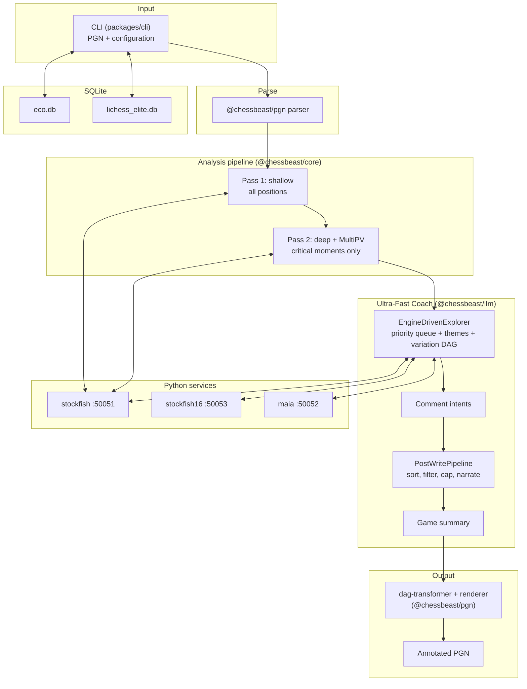
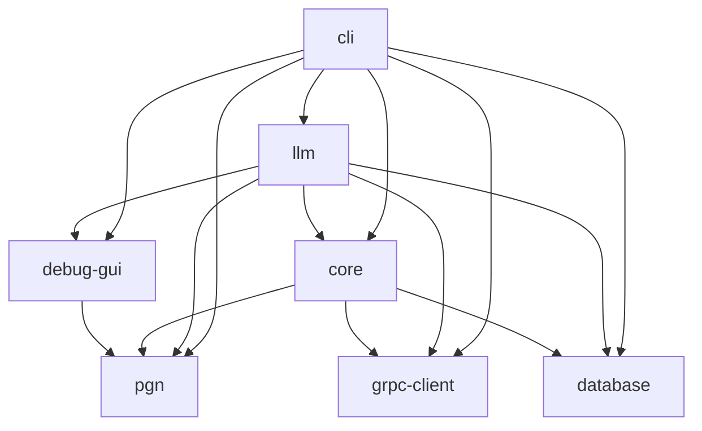

# Architecture

ChessBeast is a hybrid TypeScript + Python monorepo that turns a PGN into an annotated PGN. There is one annotation pipeline: Ultra-Fast Coach. It was built in PRs #79-#87, hardened through PRs #90-#102, and became the only pipeline in the 2026 cleanup. The engine explores first, the LLM narrates after; no LLM call ever blocks the search.

For vocabulary, see [concepts](concepts.md). For rules, see the three conventions docs: [analysis-conventions](analysis-conventions.md) owns chess correctness (notation, plies, perspective signs, eval semantics, failure handling), [annotation-conventions](annotation-conventions.md) owns how output reads (voice, budgets, density, honesty), and [performance-conventions](performance-conventions.md) owns speed and budget (hot loops, LLM fan-out, engine budget, measurement).

## System Overview

```mermaid
flowchart TB
    subgraph Input
        CLI["CLI (packages/cli)<br/>PGN + configuration"]
    end

    subgraph Parse
        PARSER["@chessbeast/pgn parser"]
    end

    subgraph Analysis["Analysis pipeline (@chessbeast/core)"]
        P1["Pass 1: shallow<br/>all positions"]
        P2["Pass 2: deep + MultiPV<br/>critical moments only"]
    end

    subgraph Annotation["Ultra-Fast Coach (@chessbeast/llm)"]
        EXPLORE["EngineDrivenExplorer<br/>priority queue + themes + variation DAG"]
        INTENTS["Comment intents"]
        POSTWRITE["PostWritePipeline<br/>sort, filter, cap, narrate"]
        SUMMARY["Game summary"]
    end

    subgraph Services["Python services"]
        STOCK["stockfish :50051"]
        SF16["stockfish16 :50053"]
        MAIA["maia :50052"]
    end

    subgraph Data["SQLite"]
        ECO["eco.db"]
        ELITE["lichess_elite.db"]
    end

    subgraph Output
        DAG["dag-transformer + renderer<br/>(@chessbeast/pgn)"]
        OUT["Annotated PGN"]
    end

    CLI --> PARSER --> P1 --> P2 --> EXPLORE
    P1 <--> STOCK
    P2 <--> STOCK
    EXPLORE <--> STOCK
    EXPLORE <--> SF16
    EXPLORE <--> MAIA
    CLI <--> ECO
    CLI <--> ELITE
    EXPLORE --> INTENTS --> POSTWRITE --> SUMMARY --> DAG --> OUT
```

The orchestrator (`packages/cli/src/orchestrator/orchestrator.ts`) runs the core analysis pipeline first, then hands the results to the annotation runner (`packages/cli/src/orchestrator/ultra-fast-coach-runner.ts`).

## The Analysis Pipeline

`packages/core/src/pipeline/analysis-pipeline.ts` runs two passes:

- **Pass 1 (shallow)**: every position, depth 14 by default, single PV. Produces evaluations, win probabilities, and move classifications.
- **Pass 2 (deep)**: critical moments only, depth 22 by default with 3 lines of MultiPV. Critical moments are detected by win-probability drop (PR #74), scored 0-100, and capped at 25% of moves. See [concepts: critical moment](concepts.md#critical-moment).

Exploration then runs on a three-tier budget derived by `getUltraFastTierConfig` in `packages/cli/src/orchestrator/ultra-fast-coach.ts`:

| Tier | Depth | Time limit | MultiPV |
|------|-------|------------|---------|
| shallow | 12 | 1.5s | 1 |
| standard | 18 | 5s | 3 |
| full | 22 | 15s | 5 |

Positions are promoted between tiers by criticality score, which also orders the exploration queue. The same score drives moment selection, so it has two consumers; see [concepts: criticality score](concepts.md#criticality-score).

All CLI-facing options (`--speed`, `--themes`, `--variations`, `--comment-density`, `--audience`, `--perspective`, `--token-budget`) flow through `ChessBeastConfig` in `packages/cli/src/config/schema.ts` and are derived into pipeline settings in `packages/cli/src/orchestrator/ultra-fast-coach.ts`. Derivation lives in exactly one place; nothing downstream re-reads raw CLI flags.

## The Annotation Pipeline

Four stages, all engine-first:

1. **Explore.** `EngineDrivenExplorer` (`packages/llm/src/explorer/engine-driven-explorer.ts`) wraps the core `PriorityQueueExplorer` (`packages/core/src/exploration/priority-queue-explorer.ts`), runs the theme detectors with lifecycle tracking, and writes every discovered line into the shared variation DAG (`packages/core/src/storage/variation-dag/`). Its output is a list of comment intents, each anchored to the after-move ply.
2. **Select.** `PostWritePipeline` (`packages/llm/src/annotation/post-write-pipeline.ts`) sorts intents by priority, runs the density filter (the filter's contract requires priority-sorted input), then applies the per-game comment cap (default 30, mandatory intents survive first).
3. **Narrate.** The `Narrator` (`packages/llm/src/narration/narrator.ts`) dedupes same-ply intents, then generates comments in parallel under a `pLimit` concurrency cap (default 5). When the LLM is unavailable, rate-limited, or the circuit breaker is open, it emits deterministic fallback comments instead of failing.
4. **Summarize and render.** `generateGameSummary` (`packages/llm/src/narration/game-summary.ts`) produces the game summary, falling back to a template when no client is available. `packages/pgn/src/transformer/dag-transformer.ts` renders the DAG, comments, and NAGs into the final PGN.

The notation boundary sits in front of all of this: the CLI engine adapter (`packages/cli/src/orchestrator/adapters.ts`) converts engine UCI PVs to SAN exactly once via `ChessPosition` (`packages/pgn/src/chess/position.ts`). Everything after the adapter speaks SAN. See [concepts: UCI vs SAN](concepts.md#uci-vs-san-and-the-one-conversion-boundary).

## Package Map

Eight TypeScript packages under `packages/` (the former `types` and `utils` packages were absorbed and deleted in the 2026 cleanup):

| Package | Purpose |
|---------|---------|
| **cli** | Entry point: `analyze` command, config schema and derivation, orchestrator, engine adapters |
| **core** | Analysis pipeline, win-probability classification, critical moments, priority-queue exploration, variation DAG |
| **llm** | Engine-driven explorer, themes, intents, post-write pipeline, narrator, game summary, OpenAI client, pricing |
| **pgn** | PGN parsing and rendering, `ChessPosition` notation boundary, DAG-to-PGN transformer |
| **grpc-client** | Typed clients for the Python services: `StockfishClient`, `Stockfish16Client`, `MaiaClient` |
| **database** | SQLite clients (`EcoClient`, `LichessEliteClient`) and loaders |
| **debug-gui** | WebSocket debug server plus terminal client with live panels |
| **test-utils** | Shared fixtures and mocks, test-only (dev dependency of cli) |

Four Python services under `services/`:

| Service | Purpose |
|---------|---------|
| **stockfish** | Stockfish engine pool for evaluation and MultiPV search |
| **stockfish16** | Stockfish 16 classical evaluation breakdown (positional term features) |
| **maia** | Maia2 model serving for human-move prediction and rating estimation |
| **common** | Shared library, no port: exception hierarchy, `@grpc_error_handler`, `GracefulServer` |

## Package Dependencies

```mermaid
flowchart TB
    CLI[cli] --> CORE[core]
    CLI --> LLM[llm]
    CLI --> PGN[pgn]
    CLI --> GRPC[grpc-client]
    CLI --> DB[database]
    CLI --> GUI[debug-gui]

    LLM --> CORE
    LLM --> PGN
    LLM --> GRPC
    LLM --> DB
    LLM --> GUI

    CORE --> PGN
    CORE --> GRPC
    CORE --> DB

    GUI --> PGN
```

`test-utils` depends on core, llm, pgn, grpc-client, and database, but only ever as a dev dependency.

## Service APIs

gRPC with Protobuf; definitions in `services/protos/`.

| Service | Port | Proto | Purpose |
|---------|------|-------|---------|
| stockfish | 50051 | `stockfish.proto` | `Evaluate` (FEN, depth, time, MultiPV, nodes), `HealthCheck` |
| maia | 50052 | `maia.proto` | `PredictMoves` (per rating band), `EstimateRating`, `HealthCheck` |
| stockfish16 | 50053 | `stockfish16.proto` | `GetClassicalEval` (SF16 classical term breakdown), `HealthCheck` |
| (shared) | | `common.proto` | Shared Position and Move types |

Engines return moves and PVs in UCI; the CLI adapter converts to SAN at the boundary.

All services map exceptions to gRPC status codes through `@grpc_error_handler` and `EXCEPTION_STATUS_MAP` in `services/common/src/common/grpc_errors.py`:

| Status | Exceptions |
|--------|------------|
| `INVALID_ARGUMENT` | `InvalidFenError`, `InvalidRatingError` |
| `RESOURCE_EXHAUSTED` | `PoolExhaustedError` |
| `UNAVAILABLE` | `PoolShutdownError`, `EngineUnavailableError`, `ModelNotLoadedError`, `ModelLoadError` |
| `DEADLINE_EXCEEDED` | `EngineTimeoutError` |
| `UNIMPLEMENTED` | `EvalNotAvailableError` |
| `INTERNAL` | `ModelInferenceError`, then the `MaiaError` and `EngineError` base classes |

How the TypeScript side degrades when a service is down is owned by [analysis-conventions](analysis-conventions.md); `--skip-maia` and `--skip-llm` exist for offline runs.

## Data Stores

Two SQLite databases, resolved from `data/` by default (`packages/cli/src/config/defaults.ts`):

| Database | Client | Purpose |
|----------|--------|---------|
| `eco.db` | `EcoClient` (`packages/database/src/clients/eco.ts`) | ECO opening classification lookup |
| `lichess_elite.db` | `LichessEliteClient` (`packages/database/src/clients/lichess.ts`) | Reference games from strong Lichess players |

Both are built locally by the loaders in `packages/database/src/loaders/` (`make setup` handles this); they are not checked in.

## Debug GUI Event Flow

The Debug GUI (introduced in PR #103, overhauled in the 2026 cleanup) is a WebSocket server embedded in the CLI plus a terminal client.

- **Server**: `--debug-gui [port]` on `chessbeast analyze` starts it via `createDebugGuiServer` (`packages/cli/src/commands/analyze.ts`); default port 9222 (`DEFAULT_DEBUG_GUI_PORT` in `packages/debug-gui/src/server/websocket-server.ts`).
- **Client**: `chessbeast-debug-gui ws://localhost:9222` renders four panels: chess board with eval bar, LLM stream, annotation queue, and engine analysis (`packages/debug-gui/src/client/components/`).
- **Events**: typed in `packages/debug-gui/src/shared/events.ts`, grouped as position updates, LLM streaming (start/chunk/end), annotation (intent/comment), engine analysis (evaluation, critical moment, exploration progress, theme detected), pipeline phases (start/progress/complete), and session lifecycle, plus client-only connection events.

The pipeline emits these events as it runs, so you can watch exploration, intent selection, and narration live against the exact game being analyzed.
